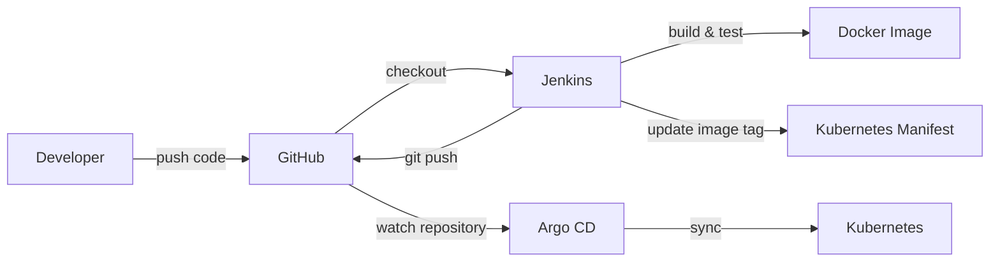

# Git Commands

These are the **most important Git commands used in daily development and DevOps workflows**.

Instead of memorizing every Git command, focus on these commands first.

---

## 1. `git clone`

Used to download an existing repository from GitHub or another Git server.

```bash
git clone <repository-url>
```

### Example

```bash
git clone git@github.com:Yuvii2102/cicd-end-to-end.git
```

**Used when:** Starting work on an existing project.

---

## 2. `git status`

Used to check the current state of the repository.

```bash
git status
```

### Example

```bash
git status
```

It shows:

- Modified files
- Untracked files
- Staged files
- Current branch

**This is one of the most commonly used Git commands.**

---

## 3. `git add`

Used to move changes from the working directory to the staging area.

### Add a specific file

```bash
git add README.md
```

### Add all changes

```bash
git add .
```

### Example

```bash
git add deploy/deploy.yaml
```

**Used when:** Preparing changes for a commit.

---

## 4. `git commit`

Used to save staged changes into the local Git repository.

```bash
git commit -m "Add Kubernetes deployment"
```

### Example

```bash
git commit -m "Update Kubernetes image"
```

A commit creates a permanent point in Git history.

---

## 5. `git log`

Used to view commit history.

### Normal

```bash
git log
```

### Compact

```bash
git log --oneline
```

### Example

```bash
git log --oneline
```

Example output:

```text
e54c143 Add Django model test
abc1234 Update Kubernetes deployment
def5678 Add Jenkins pipeline
```

**Used when:** Checking what changes were made and when.

---

## 6. `git diff`

Used to see what has changed.

### Unstaged changes

```bash
git diff
```

### Staged changes

```bash
git diff --staged
```

### Example

```bash
git diff deploy/deploy.yaml
```

**Used when:** Reviewing changes before committing.

---

# Remote Repository Commands

## 7. `git remote -v`

Used to check which remote repository is connected to the local repository.

```bash
git remote -v
```

### Example

```bash
git remote -v
```

Example output:

```text
origin  git@github.com:Yuvii2102/cicd-end-to-end.git (fetch)
origin  git@github.com:Yuvii2102/cicd-end-to-end.git (push)
```

---

## 8. `git remote add`

Used to connect a local repository to a remote repository.

```bash
git remote add origin <repository-url>
```

### Example

```bash
git remote add origin git@github.com:Yuvii2102/cicd-end-to-end.git
```

---

## 9. `git remote set-url`

Used to change the URL of an existing remote repository.

```bash
git remote set-url origin <new-url>
```

### Example

```bash
git remote set-url origin git@github.com:Yuvii2102/cicd-end-to-end.git
```

**This is directly useful in your practical work**, because you changed your GitHub remote from HTTPS to SSH.

---

# Branching Commands

## 10. `git branch`

Used to view and manage branches.

### View branches

```bash
git branch
```

### Create a branch

```bash
git branch feature-login
```

### Example

```bash
git branch feature-login
```

---

## 11. `git switch`

Used to switch between branches.

```bash
git switch main
```

### Create and switch to a new branch

```bash
git switch -c feature-login
```

### Example

```bash
git switch -c feature-login
```

**Modern Git:** Prefer `git switch` for branch switching.

---

# Remote Synchronization

## 12. `git pull`

Used to download changes from a remote repository and integrate them into the current branch.

```bash
git pull origin main
```

### Example

```bash
git pull origin main
```

Typical workflow:

```text
GitHub
  ↓
git pull
  ↓
Local Repository
```

**Used when:** You want the latest changes from the remote repository.

---

## 13. `git fetch`

Used to download the latest information from a remote repository **without automatically merging it**.

```bash
git fetch origin
```

### Example

```bash
git fetch origin
```

Difference:

```text
git fetch
    ↓
Download remote changes
    ↓
Does NOT merge automatically


git pull
    ↓
Fetch + integrate changes
```

---

## 14. `git push`

Used to upload local commits to a remote repository.

```bash
git push origin main
```

### Example

```bash
git push origin main
```

Typical workflow:

```text
Local Repository
      ↓
  git push
      ↓
    GitHub
```

### Push a new branch

```bash
git push -u origin feature-login
```

---

## 15. `git push origin HEAD:main`

This is useful in automation and CI/CD when the current checkout is not necessarily on a local branch named `main`.

```bash
git push origin HEAD:main
```

### Example from your Jenkins pipeline

```bash
GIT_SSH_COMMAND="ssh -i $SSH_KEY -o StrictHostKeyChecking=no" \
git push origin HEAD:main
```

In your Jenkins practical, this was important because Jenkins checked out the repository in a **detached HEAD state**.

Instead of:

```bash
git push origin main
```

you used:

```bash
git push origin HEAD:main
```

to push the currently checked-out commit to the remote `main` branch.

---

# Merge

## 16. `git merge`

Used to combine changes from one branch into another.

```bash
git switch main
git merge feature-login
```

### Example

```bash
git switch main
git merge feature-login
```

Flow:

```text
feature-login
      |
      | git merge
      ↓
     main
```

**Used when:** Combining completed feature work into another branch.

---

# Undo / Recovery

## 17. `git restore`

Used to discard unstaged changes or unstage a file.

### Discard changes

```bash
git restore README.md
```

### Unstage a file

```bash
git restore --staged README.md
```

### Example

```bash
git restore --staged deploy/deploy.yaml
```

---

## 18. `git revert`

Used to safely undo a commit by creating a **new commit**.

```bash
git revert <commit-hash>
```

### Example

```bash
git revert e54c143
```

This is generally safer for commits that have already been pushed to a shared repository.

```text
Commit A
   ↓
Commit B
   ↓
Commit C
   ↓
git revert B
   ↓
New commit that reverses B
```

---

## 19. `git reset`

Used to move the current branch back to an earlier state.

### Keep changes

```bash
git reset --soft HEAD~1
```

### Remove commit but keep file changes

```bash
git reset --mixed HEAD~1
```

### Remove commit and changes

```bash
git reset --hard HEAD~1
```

### Example

```bash
git reset --soft HEAD~1
```

**Important:**

```text
restore → files
reset   → local history
revert  → safe undo commit
```

> Be careful with `git reset --hard` because it can permanently remove uncommitted work.

---

# Stash

## 20. `git stash`

Used to temporarily save uncommitted changes.

```bash
git stash
```

### Example

```bash
git stash
git switch main
```

Later:

```bash
git stash pop
```

### View stashes

```bash
git stash list
```

### Apply a stash

```bash
git stash pop
```

Typical situation:

```text
Working on Feature
       ↓
Urgent task arrives
       ↓
git stash
       ↓
Work on urgent task
       ↓
Return to feature
       ↓
git stash pop
```

---

# Git Configuration

## 21. `git config`

Used to configure Git username and email.

### Username

```bash
git config --global user.name "Yuvraj"
```

### Email

```bash
git config --global user.email "your@email.com"
```

### Example

```bash
git config --global user.name "Yuvraj"
git config --global user.email "yuvraj@example.com"
```

Check configuration:

```bash
git config --list
```

---

# Tags

## 22. `git tag`

Used to mark specific versions or releases.

```bash
git tag v1.0.0
```

### Example

```bash
git tag v1.0.0
git push origin v1.0.0
```

Tags are commonly used for software releases.

```text
Commit
  ↓
v1.0.0
  ↓
Release
```

---

# The Git Commands You Should Actually Memorize

If you are preparing for **DevOps jobs**, don't try to memorize 50+ commands.

Start with these:

```bash
# Repository
git clone

# Check
git status
git log --oneline
git diff

# Changes
git add .
git commit -m "message"

# Branches
git branch
git switch
git switch -c
git merge

# Remote
git remote -v
git remote add
git remote set-url

# Sync
git fetch
git pull
git push

# DevOps / CI/CD
git push origin HEAD:main

# Undo
git restore
git revert
git reset

# Temporary work
git stash
git stash pop

# Releases
git tag

# Configuration
git config
```

---

# Most Common Company Workflow

In a real company, a normal developer workflow often looks like:

```mermaid
flowchart LR

    A["Clone Repository"]
    B["Create Branch"]
    C["Make Changes"]
    D["git status"]
    E["git add"]
    F["git commit"]
    G["git push"]
    H["Pull Request"]
    I["Code Review"]
    J["Merge"]
    K["CI/CD Pipeline"]

    A --> B
    B --> C
    C --> D
    D --> E
    E --> F
    F --> G
    G --> H
    H --> I
    I --> J
    J --> K
```



---

# Git in Your DevOps Project

Your CI/CD project follows the same basic Git workflow.



This is why Git is extremely important in DevOps:

```text
Git
 ↓
CI/CD
 ↓
Docker
 ↓
Kubernetes
 ↓
GitOps
 ↓
Argo CD
```

---

# Quick Cheat Sheet

| Command | What it does |
|---|---|
| `git clone` | Download repository |
| `git status` | Check changes |
| `git add .` | Stage changes |
| `git commit -m` | Save changes |
| `git log --oneline` | View history |
| `git diff` | See changes |
| `git branch` | View/create branches |
| `git switch` | Switch branches |
| `git merge` | Merge branches |
| `git remote -v` | Check remote |
| `git remote add` | Add remote |
| `git remote set-url` | Change remote URL |
| `git fetch` | Download remote information |
| `git pull` | Fetch + integrate |
| `git push` | Upload commits |
| `git push origin HEAD:main` | Push current HEAD to main |
| `git restore` | Restore/unstage changes |
| `git revert` | Safely undo a commit |
| `git reset` | Reset local history |
| `git stash` | Temporarily save changes |
| `git stash pop` | Restore stashed changes |
| `git tag` | Mark a release |
| `git config` | Configure Git |

---

# The 10 Commands to Master First

If you want the **absolute minimum**, master these first:

```bash
git clone
git status
git add .
git commit -m "message"
git pull
git push
git branch
git switch
git merge
git log --oneline
```

Once these become natural, learn:

```bash
git fetch
git diff
git stash
git revert
git reset
git rebase
git cherry-pick
git tag
```

> **For DevOps, the goal is not to memorize every Git command.**
>
> **Master the daily workflow first, then learn the commands used for troubleshooting, collaboration and CI/CD.**
