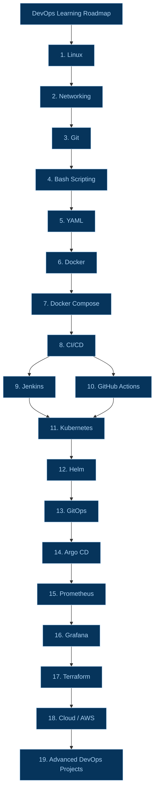

<h1 align="center">Devops-Learning-with-Yuvraj</h1>

A collection of hands-on exercises focused on learning Cloud Fundamentals and DevOps scripting.

> **Learn the fundamentals → Automate → Containerize → Deploy → Monitor → Build real projects**

### What Each Technology Teaches

- **Linux** teaches you the server.
- **Networking** teaches you how servers communicate.
- **Git** teaches you version control.
- **Bash** teaches you automation.
- **YAML** teaches you configuration.
- **Docker** teaches you containers.
- **Docker Compose** teaches you multi-container applications.
- **Jenkins / GitHub Actions** teach you CI/CD.
- **Kubernetes** teaches you container orchestration.
- **Helm** makes Kubernetes deployments easier.
- **GitOps + Argo CD** automate Kubernetes deployments from Git.
- **Prometheus + Grafana** teach monitoring and observability.
- **Terraform** teaches Infrastructure as Code.
- **AWS** teaches cloud infrastructure.
- **Projects** bring everything together.

# DevOps Learning Roadmap

